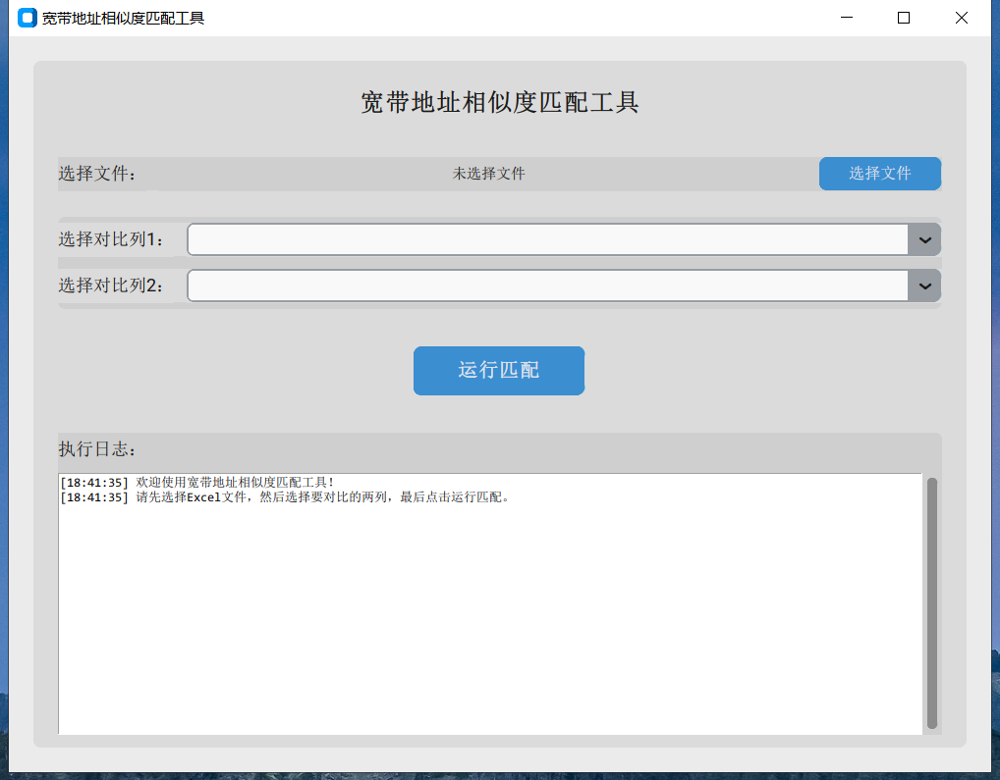

# ODN Similarity - 宽带地址相似度匹配工具

`odn_similarity` 是一个基于 Python 和 CustomTkinter 的桌面应用程序，旨在帮助用户快速、准确地对比 Excel 文件中两列地址的相似度。该工具特别适用于需要核查和匹配大量地址信息的场景，例如在电信ODN（光分配网络）资源管理中。


## ✨ 功能特性

- **简洁的用户界面**：采用 `CustomTkinter` 构建，界面美观、操作直观。
- **文件上传**：支持 `.xlsx` 和 `.xls` 格式的 Excel 文件。
- **动态列选择**：自动读取并展示文件中的所有列，方便用户选择需要对比的任意两列。
- **智能相似度算法**：
    - **关键词过滤**：在比较前自动移除地址中的常见干扰词（如“光交”、“小区”、“单元”等），提高匹配精度。
    - **Levenshtein 编辑距离**：采用业界成熟的算法计算字符串相似度。
- **实时进度反馈**：在界面下方实时显示处理日志，让用户随时了解程序运行状态。
- **结果自动保存**：处理完成后，自动在原文件同目录下生成一个名为 `【已匹配】原文件名.xlsx` 的结果文件，其中包含新计算出的“相似度”列。

## 🖥️ 软件截图



## 🚀 快速开始

### 环境要求

- Python 3.x
- 安装必要的库：
  ```bash
  pip install -r requirements.txt
  ```

### 运行程序

直接运行 `app.py` 文件即可启动应用程序：

```bash
python app.py
```

### 使用步骤

1.  **选择文件**：点击“选择文件”按钮，上传一个 Excel 文件。
2.  **选择列**：从下拉菜单中分别选择需要进行相似度对比的两列。
3.  **运行匹配**：点击“运行匹配”按钮。
4.  **查看结果**：程序将开始处理数据，并在日志区域显示进度。处理完成后，结果文件将自动保存在原文件所在的文件夹中。

## 🛠️ 技术栈

- **GUI 框架**: [CustomTkinter](https://github.com/TomSchimansky/CustomTkinter)
- **数据处理**: [Pandas](https://pandas.pydata.org/)
- **相似度算法**: [python-Levenshtein](https://github.com/maxbachmann/python-Levenshtein)
- **打包工具**: [PyInstaller](https://pyinstaller.org/)


## 📄 许可证

本项目采用 MIT 许可证。详情请见 `LICENSE` 文件。